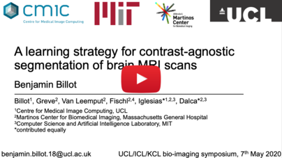
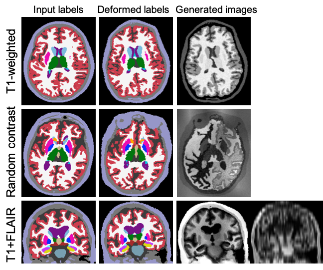
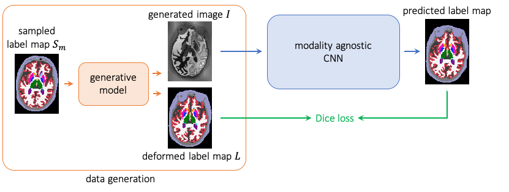

# SynthSeg

This repository contains code to train a single Convolutional Neural Network to segment MRI scans of different contrasts
 and resolutions. The network is trained with synthetic scans obtained by sampling a generative model building on the 
**[lab2im](https://github.com/BBillot/lab2im)** package, which we really encourage you to have a look at!
\
\
This project is explained in details in the following video:
\
\

\
\
\
In short, synthetic scans are generated by sampling a Gaussian Mixture Model (GMM) conditioned
on training label maps. The variability of the generated images is further extended by performing data augmentation 
steps such as spatial deformation, intensity augmentation, and random blurring. The following figure illustrates some
of the many generation possibilities offered by SynthSeg:
realistic/unrealistic, isotropic/anisotropic, uni-modal/multi-modal scans.
\
\

\
\
The generated images are then usd to train a CNN for image segmentation. Because the parameters of the GMM (means and 
variances) are sampled at each minibatch from prior distributions, the network is exposed to images yielding differences
 in contrast (depending on the GMM priors), and learns robust features. An overvoew of the training process is 
represented in the following figure:
\
\

\
\
Additionally to the `training` function, we provide the generative model `labels_to_image_model`, along with a wrapper 
`brain_generator`, which allows to easily synthesise new images. This repository also contains functions for evaluation,
 validation (which must be done offline), and prediction.

----------------
### Tutorials for Generation and Training

If you wish to train your own network or try the generative model, you can familiarise yourself with the different
parameters by trying the provided [scripts](scripts), classified in three folders:

- [tutorials](scripts/tutorials): We advise you to start here with the three simple examples of this folder.
[simple_example.py](scripts/tutorials/simple_example.py) shows how to generate images in three lines with the 
`BrainGenerator` wrapper. Then [random_contrst_generation.py](scripts/tutorials/random_contrast_generation.py) and 
[t1w_generation.py](scripts/tutorials/t1w_generation.py) introduce some basic parameters to easily generate 
images of random or constrained intenisty distributions.

- [SynthSeg_scripts](scripts/SynthSeg_scripts): this folder contains two scripts showing how we trained 
[SynthSeg](https://arxiv.org/abs/2003.01995), a contrast-agnostic network for segmenation of brain MRI scans. 
These scripts introduce some new parameters of the generative model.

- [PV-SynthSeg_scripts](scripts/PV-SynthSeg_scripts): this folder contains several scripts, among which you can find 
how we trained [PV-SynthSeg](https://arxiv.org/abs/2004.10221), a PV-aware network for segmentation of brain MRI scans.
In particular the [PV-SynthSeg_generation](scripts/PV-SynthSeg_scripts/PV-SynthSeg_generation.py) explains some advanced
parameters if you wish to generate multi-modal and/or anisotropic images.

----------------

### Content

- [SynthSeg](SynthSeg): this is the main folder containing the generative model and training function:

  - [labels_to_image_model.py](SynthSeg/labels_to_image_model.py): contains the generative model `labels_to_image_model`.
  
  - [brain_generator.py](SynthSeg/brain_generator.py): contains the class `BrainGenerator`, which is a wrapper around 
  `labels_to_image_model`. New images can simply be generated by instantiating an object of this class, and call the 
  method `generate_image()`.
  
  - [model_inputs.py](SynthSeg/model_inputs.py): contains the function `build_model_inputs` that prepares the inputs of the
  generative model.
  
  - [training.py](SynthSeg/training.py): contains the function `training` to train the segmentation network. This function
  provides an example of how to integrate the labels_to_image_model in a broader GPU model. All training parameters are 
  explained there.
  
  - [metrics_model.py](SynthSeg/metrics_model.py): contains a keras model that implements the computation of a Soft Dice 
  loss function.
  
  - [predict.py](SynthSeg/predict.py): function to predict segmentations of new MRI scans. Can also be used for testing.
  
  - [evaluate.py](SynthSeg/evaluate.py): contains functions to evaluate the accuracy of segmentations with several metrics:
  `dice_evaluation`, `surface_distances`, and `compute_non_parametric_paired_test`.
  
  - [validate.py](SynthSeg/validate.py): contains `validate_training` to validate the models saved during training, as 
  validation on real images has to be done offline.
  
  - [supervised_training.py](SynthSeg/supervised_training.py): contains all the functions necessary to train a model on 
  real MRI scans.
  
  - [estimate_priors.py](SynthSeg/estimate_priors.py): contains functions to estimate the prior distributions of the GMM
  parameters.
 
 - [script](scripts): additionally to the tutorials, we also provide functions such as to launch your own trainings.

- [ext](ext): contains external packages, especially the *lab2im* package, and a modified version of *neuron*.

----------------

### Requirements
 
This code relies on several external packages (already included in `\ext`):

- [lab2im](https://github.com/BBillot/lab2im): contains functions for data augmentation, and a simple version of 
 the generative model, on which we build to build `label_to_image_model`
 
- [neuron](https://github.com/adalca/neuron): contains functions for deforming, and resizing tensors, as well as 
functions to build the segmentation network [1,2].

- [pytool-lib](https://github.com/adalca/pytools-lib): library required by the *neuron* package.

All the other requirements are listed in requirements.txt. We list here the important dependencies:

- tensorflow-gpu 2.0
- tensorflow_probability 0.8
- keras > 2.0
- cuda 10.0 (required by tensorflow)
- cudnn 7.0
- nibabel
- numpy, scipy, sklearn, tqdm, pillow, matplotlib, ipython, ...

----------------

### Citation/Contact

If you use this code, please cite the following papers:

**A Learning Strategy for Contrast-agnostic MRI Segmentation** \
Benjamin Billot, Douglas N. Greve, Koen Van Leemput, Bruce Fischl, Juan Eugenio Iglesias*, Adrian V. Dalca* \
*contributed equally \
accepted for MIDL 2020 \
[ [arxiv](https://arxiv.org/abs/2003.01995) | [bibtex](bibtex.txt) ]

**Partial Volume Segmentation of Brain MRI Scans of any Resolution and Contrast** \
Benjamin Billot, Eleanor D. Robinson, Adrian V. Dalca, Juan Eugenio Iglesias \
under revision \
[ [arxiv](https://arxiv.org/abs/2004.10221) | [bibtex](bibtex.txt) ]

If you have any question regarding the usage of this code, or any suggestions to improve it you can contact us at: \
benjamin.billot.18@ucl.ac.uk

----------------

### References

[1] *Anatomical Priors in Convolutional Networks for Unsupervised Biomedical Segmentation* \
Adrian V. Dalca, John Guttag, Mert R. Sabuncu \
CVPR 2018 \
[link]((http://www.mit.edu/~adalca/files/papers/cvpr2018_priors.pdf))

[2] *Unsupervised Data Imputation via Variational Inference of Deep Subspaces* \
Adrian V. Dalca, John Guttag, Mert R. Sabuncu \
Arxiv preprint 2019 \
[link](https://arxiv.org/abs/1903.03503)
